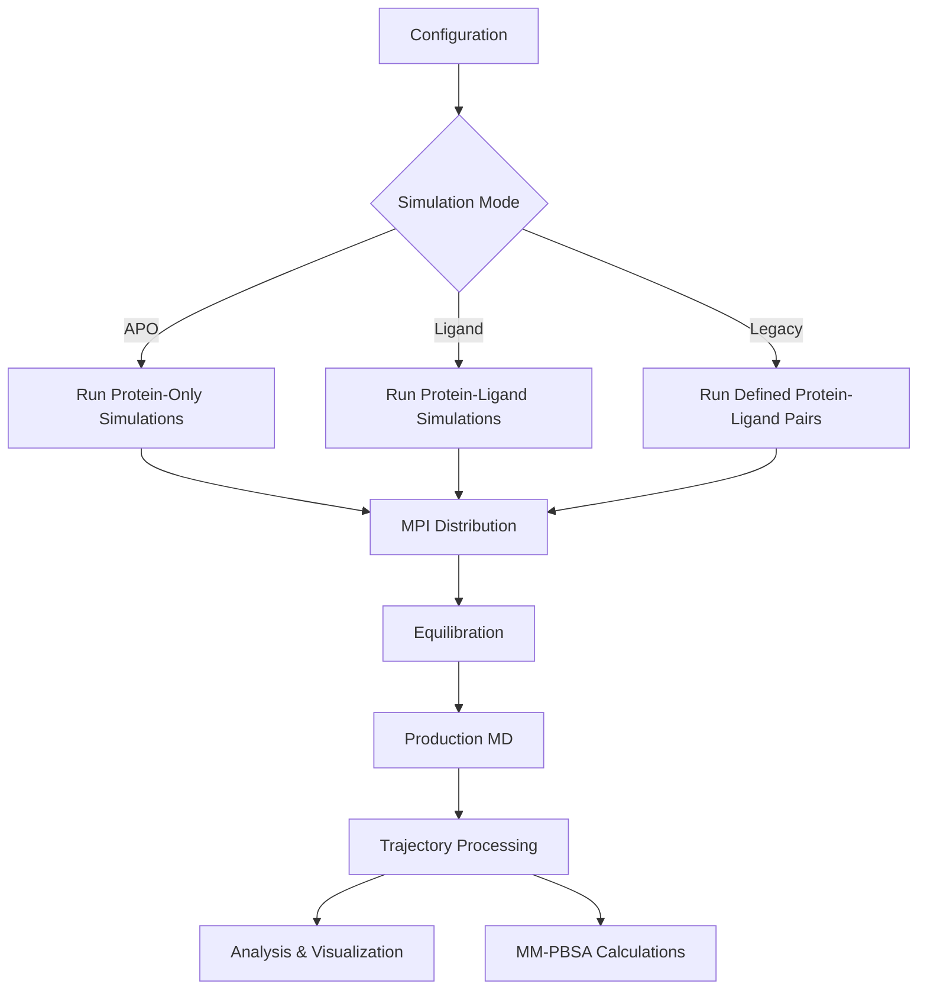

# LumiHPC MolecularDynamic

LumiHPC MolecularDynamic is a high-performance package for running molecular dynamics simulations optimized for HPC environments. Built on OpenMM with MPI parallelization, this package enables efficient, scalable simulations across multiple GPUs and nodes.

## Key Features

- **Highly Scalable**: Run multiple simulations in parallel using MPI
- **Multiple Simulation Modes**:
  - APO mode (protein-only)
  - Ligand mode (protein-ligand complexes)
  - Legacy mode (explicit protein-ligand pairs)
- **Complete Workflow**:
  - System preparation with automatic force field assignment
  - Staged equilibration (heating, pressure equilibration)
  - Production MD with efficient checkpointing
  - Comprehensive trajectory analysis
- **Analysis Tools**:
  - RMSD, RMSF, radius of gyration calculations
  - PCA, clustering, normal mode analysis
  - Interactive visualizations with plotly and nglview
  - MM-PBSA binding free energy calculations

## Workflow Overview



## Quick Start

To run a basic MD simulation on your local machine:

1. **Create a configuration file** (or use an example from `docs/md_config_template.toml`):

```toml
[mode]
type = "apo"  # Use "apo" for protein-only simulations

[paths]
protein_folder = "./Proteins"
protein_glob_pattern = "*.pdb"

[system]
delta_pico = 0.002
rerun = false

[nvt]
steps = 5000
dcd_save = 500
log_save = 100
temps_list = [50, 100, 150, 200, 250, 300]

[npt]
steps = 5000
dcd_save = 500
log_save = 100
rests_list = [100000, 10000, 1000, 100, 10, 1]
atoms_to_restraints = ["CA"]

[md]
steps = 50000
dcd_save = 1000
log_save = 100
```

2. **Run the simulation** using the MPI wrapper:

```bash
# For local execution with 2 processes
mpirun -n 2 python Wrappers_Local/LOCAL_MPI_MD_Wrapper.py my_config.toml
```

3. **Analyze results** using the example notebook:

```bash
jupyter notebook Analysis_Example.ipynb
```

## Configuration Options

The package uses TOML configuration files. See complete examples in the `docs` directory.

### Simulation Modes

#### APO Mode (Protein-Only)
```toml
[mode]
type = "apo"

[paths]
protein_folder = "./Proteins"
protein_glob_pattern = "*.pdb"
```

#### Ligand Mode (Protein-Ligand)
```toml
[mode]
type = "lig"

[paths]
ligand_folder = "./Ligands"
ligand_glob_pattern = "*.sdf"
fixed_receptor_path = "./receptor.pdb"
```

#### Legacy Mode (Explicit Pairs)
```toml
[mode]
type = "legacy"

[legacy.runs]
Run1 = { protein = "./Proteins/protein1.pdb", ligand = "./Ligands/ligand1.sdf" }
Run2 = { protein = "./Proteins/protein2.pdb", ligand = "APO" }
```

### Common Settings

```toml
[system]
delta_pico = 0.002  # Time step in picoseconds
rerun = false       # Continue from checkpoint if true

[nvt]
steps = 5000        # Steps for NVT phase
dcd_save = 500      # Save trajectory every N steps
log_save = 100      # Save log every N steps
temps_list = [50, 100, 150, 200, 250, 300]  # Temperature stages

[npt]
steps = 5000
dcd_save = 500
log_save = 100
rests_list = [100000, 10000, 1000, 100, 10, 1]  # Restraint stages
atoms_to_restraints = ["CA"]  # Atoms to restrain

[md]
steps = 50000       # Production MD steps
dcd_save = 1000     # Save trajectory every N steps
log_save = 100      # Save log every N steps
```

For a complete reference, see `docs/md_config_template.toml`.

## Running on HPC Systems

### MPI-Based Parallelization

LumiHPC MolecularDynamic uses MPI for efficient distribution of simulations:

1. The master process (rank 0) handles work distribution
2. Worker processes (ranks 1+) run simulations with GPU acceleration
3. Each simulation is assigned to a specific GPU based on MPI rank
4. Dynamic load balancing ensures efficient resource utilization

### Using SLURM for Job Submission

Edit the provided SLURM script template:

```bash
# Edit MPI_MD_Wrapper_RUN.sh with appropriate settings
nano Wrappers_HPC/MPI_MD_Wrapper_RUN.sh

# Submit the job
sbatch Wrappers_HPC/MPI_MD_Wrapper_RUN.sh
```

Key SLURM parameters to adjust:
- `--ntasks-per-node`: Number of MPI processes per node
- `--gpus-per-node`: Number of GPUs to use
- `--cpus-per-task`: CPU cores per MPI process
- `--account`: Your project account

## Analysis Tools

### Running Analysis Workflows

After simulations complete, analyze trajectories using either:

1. **Jupyter Notebook** (see `Analysis_Example.ipynb`):
```python
# Find simulation directories
files_paths = find_matching_directories(["idx_\\d+_Rank_\\d+_.*"])

# Create analyzers for each directory
analysis_paths = create_analyzer_dict(files_paths, overwrite=False)

# Generate and save plots
plotter_saver(
    analysis_paths,
    output_dir="Charts",
    plot_types=['RMSF', 'RMSD', 'Radius', 'Gaussian', 'PCA'],
    show=True
)
```

2. **Parallel MPI Analysis**:
```bash
# Run analysis on all directories matching a pattern using 8 MPI processes
mpirun -n 8 python Wrappers_HPC/MPI_Analysis.py "idx_*"

# Or submit as a SLURM job
sbatch Wrappers_HPC/MPI_Analysis_RUN.sh
```

### Available Analysis Types

- **RMSF**: Root Mean Square Fluctuation (protein flexibility)
- **RMSD**: Root Mean Square Deviation (structural stability)
- **Radius**: Radius of gyration (protein compactness)
- **Gaussian**: Gaussian Network Model (collective motions)
- **PCA**: Principal Component Analysis (major conformational changes)

All plots are saved as interactive HTML files (except PCA, which uses matplotlib).

### Trajectory Archive

Create a ZIP archive of trajectory files for sharing or backup:

```python
create_trajectory_archive("trajectories.zip", analysis_paths)
```

### Interactive Visualization

View trajectories with nglview (requires nglview installation):

```python
VIEW = TrajectoryViewer(analysis_paths, "Simulation_Directory_Name")
VIEW()
```

## MM-PBSA Calculations

Calculate binding free energies with MM-PBSA:

```python
from HPC_MD.Calc_MMPBSA import Wrapper_MMPBSA

# Run MM-PBSA on all simulation directories
mmpbsa_wrapper = Wrapper_MMPBSA(analysis_paths)
results_df = mmpbsa_wrapper()

# Display and sort results
print(results_df.sort_values(by='GB'))
```

## Core Components

- **HPC_MD/**: Core simulation and analysis code
  - `Vanilla_MD.py`: Main MD simulation engine
  - `Analysis_Lig.py`: Trajectory analysis tools
  - `Calc_MMPBSA.py`: MM-PBSA calculations
  - `Call_Runner.py`: Job script generator for HPC systems
  - `Lumi_Interface.py`: SSH interface for LUMI HPC system
- **Wrappers_HPC/**: Scripts for HPC execution
  - `MPI_MD_Wrapper.py`: Parallel simulation runner
  - `MPI_Analysis.py`: Parallel trajectory analyzer
- **docs/**: Configuration examples

## Job Management & HPC Integration

LumiHPC MolecularDynamic provides tools for creating job scripts and managing HPC workflows.

### Job Script Generation

Use `Call_Runner.py` to generate customized SLURM job scripts:

```bash
# Generate MD job script
python HPC_MD/Call_Runner.py --type md --wrapper-path Wrappers_HPC/MPI_MD_Wrapper.py --output md_job.sh

# Generate analysis job script
python HPC_MD/Call_Runner.py --type analysis --analysis-script HPC_MD/Analysis_Lig.py --script-args "--input trajectory.dcd"
```

Or import as a module:

```python
from HPC_MD.Call_Runner import generate_md_runner

# Create MD job script with custom parameters
script = generate_md_runner(
    job_name="LAG3_Simulation",
    nodes=2,
    ntasks_per_node=4,
    gpus_per_node=4,
    time="10:00:00",
    account="project_465001750",
    wrapper_path="Wrappers_HPC/MPI_MD_Wrapper.py",
    toml_config={
        "mode": {"type": "lig"},
        "paths": {
            "ligand_folder": "./LAG3_Ligands",
            "fixed_receptor_path": "./LAG3_receptor.pdb"
        },
        "md": {"steps": 500000}
    }
)

# Write to file
with open("lag3_job.sh", "w") as f:
    f.write(script)
```

### Remote HPC Interaction

Use `Lumi_Interface.py` to connect to LUMI and manage files and jobs:

```python
from HPC_MD.Lumi_Interface import HPCConnection

# Connect to LUMI
connection = HPCConnection(
    hostname="lumi.csc.fi",
    username="your_username",
    key_path="~/.ssh/id_ed25519",
    key_passphrase="your_passphrase"  # Optional
)
connection.connect()

# Upload files and directories
connection.upload_directory("./simulation_files", "/scratch/project_XXX/simulations")
connection.upload_file("md_job.sh", "/scratch/project_XXX/simulations/md_job.sh")

# Submit job and check status
job_id = connection.submit_job("md_job.sh", working_dir="/scratch/project_XXX/simulations")
status = connection.check_job_status(job_id)
print(f"Job status: {status}")

# Download results when complete
connection.download_directory("/scratch/project_XXX/simulations/results", "./local_results")

# Disconnect when done
connection.disconnect()
```

## Best Practices

1. **Start small**: Test configurations with short simulations before production runs
2. **Use checkpointing**: Enable rerun=true to continue from crashes
3. **Match GPUs and MPI ranks**: For optimal performance, use one MPI rank per GPU
4. **Analysis scaling**: Use MPI_Analysis for large numbers of trajectories